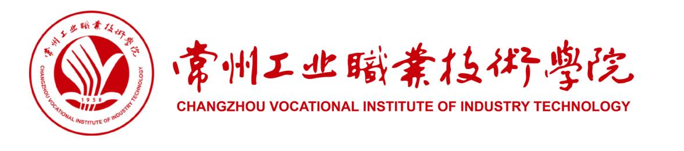

  

|              |                          |
|:------------:|:------------------------:|
| **二级学院** |       信息工程学院       |
|  **执笔人**  |      宋永顺 丰爱松       |
| **合作企业** | 中质智通检测技术有限公司 |
|  **审核人**  |           李斐           |
| **制定日期** |        2026年5月         |

常州工业职业技术学院教务处制

2026年5月

---

# 人才培养方案更改纪录

| 序号 | 更改类型 | 更改内容 | 更改说明 |
|:----:|:--------:|:--------:|:--------:|
| 1 | 增设课程 | 1.增加《中华民族发展史》（公共基础课） 2.增加《新能源汽车概论》（专业拓展课） 3.增加《数据库技术》（专业基础课） 4.增加《网页设计与制作》（专业基础课） 5.增加《操作系统应用》（专业基础课） 6. 增加《专业选修课一》（从《智能穿戴技术应用》、《软件工程与UML设计》、《网络安全与黑客技术》、《PLC系统编程与维护》中任选一门） 7. 增加《专业选修二》（从《视觉检测技术》、《自动驾驶平台测试与维护》、《数据可视化技术与应用》、《基于AI的自动驾驶技术》中任选一门） 7. 增加《人工智能专业实践》（专业拓展课） | 根据国家专业教学标准和企业调研结果 |
| 2 | 更改课程名称 | 1.《信息技术实训》更改为《信息技术（氛围编程）实训》 2. 《C 语言程序设计》更改为《程序设计基础（C）》 3.《python程序设计》（专业拓展课）更改为《程序设计基础(python)》（专业基础课） 4. 《汽车网络通信基础》更改为《计算机网络技术》 5. 《顶岗实习1》更改为《岗位实习1》，《顶岗实习2》更改为《岗位实习2》 | 根据国家专业教学标准和企业调研结果 |
| 3 | 更改课程性质 | 1.《智能网联汽车概论》从专业基础课更改为专业核心课 2.《汽车电工电子》从专业基础课更改为专业核心课 3.《单片机技术应用》从专业基础课更改为专业核心课 | 根据课程项目化授课需求 |
| 4 | 更改课程开设学期 | | 根据教学管理和教学资源共享需求 |
| 5 | 新增教学关键要素 | 1.聘任宋永顺为新一轮专业带头人 | 根据专业建设情况新增实验实训室、校外合作企业基地等 |
| 6 | 其他 | 1. 删除《车路协同系统装调与测试》 2. 删除《智能网联整车装调与测试》 3. 删除《专业综合实践》 | 根据教学管理和教学资源共享需求 |

---

# 目录

1. 专业名称（专业代码）
2. 入学基本要求
3. 基本修业年限
4. 职业面向
5. 培养目标与培养规格
6. 课程设置及要求
7. 教学进程总体安排
8. 实施保障
9. 毕业要求
10. 附录

---

# 一、 专业名称（专业代码）

智能网联汽车技术（460704）

---

# 二、 入学基本要求

普通高级中学毕业、中等职业学校毕业或具备同等学力

---

# 三、 基本修业年限

三年

---

# 四、 职业面向

**表1 主要岗位群（或技术领域）**

| | |
|:------------------------:|:---------------------------------------------------------------------------------------------------:|
| **所属专业大类（代码）** | 装备制造大类（46） |
| **所属专业类（代码）** | 汽车制造类（4607） |
| **对应行业（代码）** | 汽车制造业（36）、智能车载设备制造（3962）、汽车修理与维护（8111） |
| **主要职业类别（代码）** | 汽车工程技术人员 L（2-02-07-11）、汽车运用工程技术人员（2-02-15-01）、汽车整车制造人员（6-22-02）、汽车维修工（4-12-01-01）、智能网联汽车测试员 S（4-04—5-15）、智能网联汽车装调运维员 S（6-31-07-05） |
| **主要岗位（群）或技术领域** | 研发辅助：智能网联汽车整车及系统（部件）样品试制、试验，生产制造：智能网联汽车整车及系统（部件）成品装配、调试、标定、测试、质量检验及相关工艺管理和现场管理，营运服务：智能网联汽车售前售后技术支持…… |
| **职业类证书** | 智能网联汽车测试装调、智能网联汽车共享出行服务…… |

---

# 五、 培养目标与培养规格

## （一）培养目标

本专业培养能够践行社会主义核心价值观，传承技能文明，德智体美劳全面发展，具有一定的科学文化水平，良好的人文素养、科学素养、数字素养、职业道德、创新意识，爱岗敬业的职业精神和精益求精的工匠精神，较强的就业创业能力和可持续发展的能力，掌握本专业知识和技术技能，具备职业综合素质和行动能力，面向汽车制造业的智能车载设备制造、汽车修理与维护等行业的汽车工程技术人员、汽车运用工程技术人员、汽车整车制造人员、汽车维修工等职业，能够从事智能网联汽车整车及系统（部件）的样品试制、试验，成品装配、调试、标定、测试、质量检验及相关工艺管理和现场管理，售前售后技术支持工作的高技能人才。

## （二）培养规格

本专业学生应在系统学习本专业知识并完成有关实习实训基础上，全面提升知识、能力、素质，掌握并实际运用岗位（群）需要的专业核心技术技能，实现德智体美劳全面发展，总体上须达到以下要求：

（1）坚定拥护中国共产党领导和中国特色社会主义制度，以习近平新时代中国特色社会主义思想为指导，践行社会主义核心价值观，具有坚定的理想信念、深厚的爱国情感和中华民族自豪感；

（2）掌握与本专业对应职业活动相关的国家法律、行业规定，掌握绿色生产、环境保护、安全防护、质量管理等相关知识与技能，了解相关行业文化，具有爱岗敬业的职业精神，遵守职业道德准则和行为规范，具备社会责任感和担当精神；

（3）掌握支撑本专业学习和可持续发展必备的语文、数学、外语（英语等）、信息技术等文化基础知识，具有良好的人文素养与科学素养，具备职业生涯规划能力；

（4）具有良好的语言表达能力、文字表达能力、沟通合作能力，具有较强的集体意识和团队合作意识，学习1门外语并结合本专业加以运用；

（5）掌握汽车机械基础、机械制图、汽车电工电子技术、单片机技术应用、C 语言程序设计、汽车网络通信基础、智能网联汽车概论、汽车构造等方面的专业基础理论知识；

（6）掌握智能网联汽车整车生产制造技术技能，具有智能传感器、计算平台、线控底盘、智能座舱等系统（部件）的整车装配、调试能力；

（7）掌握智能网联汽车整车参数调优与质量检测技术技能，具有整车标定与测试能力；

（8）掌握智能网联汽车整车故障诊断技术技能，具有维修故障车辆的能力；

（9）掌握智能网联汽车整车和系统（部件）试验、测试技术技能，具有搭建整车测试场景、记录和分析测试数据的能力；

（10）掌握汽车生产现场管理技术技能，具有生产现场班组、设备、质量、安全生产等组织管理能力；

（11）掌握智能网联汽车技术服务技术技能，具有解决智能网联汽车产品售前售后问题的能力；

（12）掌握信息技术基础知识、氛围编程和AI工具使用技巧，具有适应本行业数字化和智能化发展需求的数字技能；

（13）具有探究学习、终身学习和可持续发展的能力，具有整合知识和综合运用知识分析问题和解决问题的能力；

（14）掌握身体运动的基本知识和至少1项体育运动技能，达到国家大学生体质健康测试合格标准，养成良好的运动习惯、卫生习惯和行为习惯；具备一定的心理调适能力；

（15）掌握必备的美育知识，具有一定的文化修养、审美能力，形成至少1项艺术特长或爱好；

（16）树立正确的劳动观，尊重劳动，热爱劳动，具备与本专业职业发展相适应的劳动素养，弘扬劳模精神、劳动精神、工匠精神，弘扬劳动光荣、技能宝贵、创造伟大的时代风尚。

---

# 六、 课程设置及要求

本专业课程主要包括公共基础课和专业（技能）课程。其中，专业（技能）课程包括专业基础课、专业核心课、专业实践课和专业拓展课。

**表2 全部课程**

| 序号 | 课程类别 | 描述 |
|:----:|:--------:|:-----|
| 1 | 公共基础课 | 根据党和国家有关文件规定，将入学教育与急救技能、思想道德与法治、毛泽东思想和中国特色社会主义理论体系概论、习近平新时代中国特色社会主义思想概论、"五史"教育、形势与政策、高等数学、大学英语、体育、军事理论、军训、大学生国家安全教育、大学生职业生涯规划、就业指导、大学生心理健康教育、劳动通识教育、创业之旅、人工智能通识、信息技术（氛围编程）等列入公共基础必修课。 |
| 2 | 专业基础课 | 程序设计基础（python）、程序设计基础（C）、计算机网络技术、数据库技术、网页设计与制作、操作系统应用 |
| 3 | 专业核心课 | 智能网联汽车概论、汽车电工电子技术、单片机技术应用、智能传感器装调与测试、计算平台部署与测试、底盘线控系统装调与测试、智能座舱系统装调与测试 |
| 4 | 专业实践课 (实践性教学环节) | C语言程序设计实训、智能汽车单片机实训、嵌入式系统应用实训、车路协同（V2X）实训、智能网联汽车线控驱动及制动实训、智能网联汽车线控转向实训、传感器装配及标定实训、人工智能实训、智能网联整车综合测试、岗位实习1、岗位实习2、毕业设计 |
| 5 | 专业拓展课 | 专业拓展课总课时不低于128，包括：新能源汽车概论、数学建模与数据分析、人工智能专业实践、专业选修课一、专业选修课二 |

---

## （一）公共基础课

**表3 公共基础课程目标**

| 课程模块 | 课程名称 | 课程性质 | 课程目标 |
|:--------:|:--------:|:--------:|:--------:|
| 思政教育课程模块 | 思想道德与法治 | 必修 | 引导学生提高思想道德素质和法治素养，成长为自觉担当民族复兴大任的时代新人。 |
| 思政教育课程模块 | 毛泽东思想和中国特色社会主义理论体系概论 | 必修 | 引导学生系统把握马克思主义中国化时代化理论成果所蕴含的马克思主义立场、观点和方法，坚定中国特色社会主义道路自信、理论自信、制度自信、文化自信，增进政治认同、思想认同、情感认同，使其努力成为堪当民族复兴重任的时代新人。 |
| 思政教育课程模块 | 习近平新时代中国特色社会主义思想概论 | 必修 | 帮助学生深入领会和理解习近平新时代中国特色社会主义思想的重大意义、丰富内涵、核心要义、精神实质和实践要求。引导学生深刻把握习近平新时代中国特色社会主义思想贯穿的马克思主义立场观点方法。引领学生紧密联系新时代中国特色社会主义生动实践，在知行合一、学以致用上下功夫，增强学生为实现中华民族伟大复兴的中国梦而奋斗的责任意识与使命担当。 |
| 思政教育课程模块 | 形势与政策 | 必修 | 提高大学生运用马克思主义理论分析国内、国际形势与政策的能力和大学生思想政治素养。 |
| 思政教育课程模块 | “五史”教育 | 必修 | 通过开发“五史”专题内容设计，采用线上线下结合的方式，开发“五史”特色课程，学生在学“五史”中深化思想基础、升华感悟境界、厚植家国情怀。（分为五个模块：中国共产党历史、新中国史、改革开放史、社会主义发展史、中华民族发展史） |
| 创新创业课程模块 | 创意创新训练 | 必修 | 通过基于设计思维的创新思维及工具方法训练，培养学生的问题意识、批判意识和创造性思维，提升学生发现新事物、探索新领域、寻求新方法等方面的能力，以及创新性解决实际问题的综合能力。 |
| 创新创业课程模块 | 创业之旅 | 必修 | 立足培养学生的创业意识和创业精神，着重提升学生的创新创业能力，强化创业知识的实际应用，强调与专业结合，与职业生活紧密结合。 |
| 文化传承与人文素养 | 大学语文 | 必修 | 培养学生听说读写母语应用能力、文学鉴赏能力与沟通表达、应用写作能力等通用职业能力，提升人文素养。 |
| 文化传承与人文素养 | 大学英语1 | 必修 | 通过课程学习，培养学生在工作和社会交往中用英语有效地进行口头和书面信息交流；同时增强其自主学习能力、跨文化交际能力及综合文化素养，培养其逻辑思维能力、主动学习的意识和合作精神。 |
| 文化传承与人文素养 | 大学英语2 | 必修 | 通过课程学习，培养学生在真实或模拟的情境中求职和进行职业活动的语言综合应用能力、跨文化交流能力、语言学习策略和职业素养，以满足中外职场环境下对英语应用型人才的需求。 |
| 文化传承与人文素养 | 高等数学1 | 必修 | 通过课程学习，让学生掌握数学基础知识，促进学生数学应用、自主学习、交流表达、自我提高、与人合作、解决问题等能力。 |
| 人工智能素养模块 | 人工智能通识 | 必修 | 聚焦人工智能基础与应用，结合智能语音、图像识别等常见场景，介绍大模型、生成式AI等前沿概念。帮助学生理解AI原理，掌握AI工具使用技巧，提升数字化思维与创新能力，为未来职业发展奠定基础。 |
| 人工智能素养模块 | 信息技术（氛围编程）/信息技术（氛围编程）实训 | 必修 | 通过学习能够增强信息意识、提升计算思维、促进数字化创新与发展能力、树立正确的信息社会价值观和责任感，为其职业发展、终身学习和服务社会奠定基础。 |
| 人工智能素养模块 | AI辅助程序设计基础 | 必修（部分学院） | 通过学习能够增强程序设计意识、提升计算思维与逻辑分析能力、促进AI辅助开发与工程实践能力、树立规范编程与数据安全意识，为其专业学习、岗位实践和持续创新发展奠定基础。 |
| 人工智能素养模块 | 人工智能专业实践 | 专业拓展 | 通过学习能够增强人工智能应用意识、提升智能化分析与人机协同能力、促进AI赋能专业实践与创新发展能力、树立正确的数字伦理观和技术责任意识，为其职业发展、终身学习和服务产业数字化转型奠定基础。 |
| 国防教育与身心健康 | 体育 | 必修 | 采用系统的课堂教学与有组织的课外体育活动相结合的方式，传授体育的基本知识、技能和方法，增进学生身心健康、增强体质，提升综合职业能力，形成终身参与体育锻炼的良好习惯，提升学生职业素养。 |
| 国防教育与身心健康 | 大学生心理健康教育 | 必修 | 旨在使学生明确心理健康的标准及意义，增强自我心理保健意识和心理危机预防意识，掌握并应用心理健康知识，培养自我认知能力、人际沟通能力、自我调节能力，切实提高心理素质，促进学生全面发展。 |
| 国防教育与身心健康 | 军训 | 必修 | 通过条令条例教育与训练、轻武器射击、战术、军事地形学、综合训练等项目的训练，增强学生的纪律性与凝聚力，提高身体素质，培养吃苦耐劳精神，增强团队合作意识。 |
| 国防教育与身心健康 | 军事理论 | 必修 | 培养学生的思想政治觉悟，激发爱国热情，增强国防观念和国家安全意识；使学生掌握基本军事知识和技能，为中国人民解放军培养后备兵员和预备役军官、为国家培养社会主义事业的建设者和接班人打好基础。 |
| 国防教育与身心健康 | 入学教育与急救技能 | 必修 | 帮助学生了解校纪校规、学院生活环境、大学学习要求与毕业要求；开展《实验室安全准入教育》课程学习，提高学生实验室安全知识和安全意识。分专题进行急救知识的讲解，使学生掌握必要的自救互救知识和技能。 |
| 国防教育与身心健康 | 大学生国家安全教育 | 必修 | 通过结合讲授时事热点和经典案例等不同类型的内容，帮助学生系统掌握中国特色国家安全体系，树立国家安全底线思维，将国家安全意识转化为自觉行动，强化责任担当。 |
| 职业素养 | 大学生职业生涯规划 | 必修 | 通过学习，树立积极的职业态度和就业观念，掌握职业生涯规划方法，具备自我认识和分析技能。 |
| 职业素养 | 就业指导 | 必修 | 通过系统化的就业指导，使学生了解就业形势和就业政策，提高就业竞争意识，形成正确的就业观。 |
| 职业素养 | 劳动通识教育 | 必修 | 强化劳动精神、工匠精神，指导劳动实践，将德智体美劳全面发展的高素质劳动者作为课程培养目标。 |

---

## （二）专业（技能）课程

专业群课程体系遵循“底层共享、中层分立、高层互选”原则，群内专业的底层专业基础课程（含实践课程）必须一致；中层专业核心课程来自典型企业生产性项目，每门课程包含4-6个典型工作任务，全部课程至少融入1个AI+教学场景；高层拓展课程超前布局“四新”课程；各门课程的课程目标、主要内容和教学要求，见附录2：《课程标准汇编》。

**表4 专业基础（含专业基础实践技能）课程目标**

| 课程名称 | 项目化教学内容 | 课程目标 |
|:--------:|:--------------:|:---------|
| 程序设计基础（python） | ①基础数据处理小程序开发项目 ②流程控制实用案例项目 ③函数与模块化编程项目 ④序列数据处理项目 ⑤简易综合工具开发项目 | 旨在让学生掌握Python基础语法、数据类型、流程控制、函数及序列结构等核心知识，理解模块化编程思想与代码规范。通过项目实操训练，培养学生基础程序编写、代码调试、问题排查的实操能力，具备拆解简单业务问题、开发轻量化数据处理工具的基础能力，同时塑造严谨的逻辑思维和规范的编码习惯，为后续各专业核心技术课程学习和岗位实操奠定扎实的通用编程基础。 |
| 程序设计基础（C） | ①基础语法与数值运算项目 ②结构化流程控制项目 ③数组与批量数据处理项目 ④函数与指针基础应用项目 ⑤结构化综合实训项目 | 让学生掌握C语言基础语法、结构化程序设计、数组、函数、指针等核心知识，理解程序底层运行与数据存储原理。通过各类结构化编程项目实训，培养学生结构化编程思维，具备独立编写、调试、优化基础程序的能力，可解决常见的数值计算、数据统计等基础问题，养成规范严谨的底层编码习惯，为后续各类高级语言学习、系统开发、底层运维等专业学习提供核心底层支撑。 |
| 程序设计基础（Java） | ①Java基础环境与语法实操项目 ②流程控制与数组应用项目 ③面向对象基础实操项目 ④常用工具类与异常处理项目 ⑤综合管理项目 | 帮助学生掌握Java开发环境配置、基础语法、流程控制、数组、面向对象、工具类及异常处理等核心知识，理解面向对象编程核心思想。通过综合项目实训，培养学生基础程序开发、调试与异常处理能力，能够运用面向对象思维拆解基础业务需求、开发通用轻量化功能，树立规范化、模块化的开发理念，适配所有信工专业后续后端、大数据、物联网等核心课程的学习需求。 |
| 计算机网络技术 | ①网络基础认知与布线实训项目 ②IP地址配置与网络连通项目 ③局域网搭建与配置项目 ④网络设备基础配置项目 ⑤网络故障排查与维护项目 | 涵盖网络基础理论、TCP/IP协议、IP规划、局域网组网、网络设备配置及网络运维等核心知识。通过布线、组网、配网、故障排查等实操项目，使学生具备小型局域网搭建、基础网络配置、常用网络命令操作和常见网络故障排查能力，培养标准化运维习惯与网络安全意识，满足各信工专业网络环境搭建、系统部署、日常运维的通用基础岗位需求。 |
| 数据库技术 | ①数据库环境搭建与基础操作项目 ②数据表设计与管理项目 ③基础SQL语句实操项目 ④复杂查询与数据统计项目 ⑤小型数据库综合设计项目 | 讲授关系型数据库基础、数据表设计规范、SQL增删改查、复杂查询及数据库运维等核心知识。通过场景化项目实训，让学生具备数据库环境搭建、规范化表结构设计、业务数据处理、数据统计分析的实操能力，树立数据规范化管理与数据安全思维，为软件开发、大数据处理、物联网数据管理、后台运维等所有信工专业相关学习与实操提供核心数据基础支撑。 |
| 网页设计与制作 | ①网页基础结构搭建项目 ②CSS样式美化项目 ③响应式基础布局项目 ④JavaScript基础交互项目 ⑤通用静态网站综合制作项目 | 系统讲解HTML结构、CSS布局美化、响应式适配及JavaScript基础交互等前端核心知识与开发规范。通过多场景网页制作项目实训，培养学生静态网页搭建、页面美化、多终端适配和基础交互开发的能力，培养标准化开发习惯与用户体验思维，适配前端开发、后端开发、信息化展示等各类信工专业的基础页面开发与场景展示需求。 |
| 操作系统应用 | ①系统安装与基础环境配置项目 ②文件与磁盘管理项目 ③进程与服务管理项目 ④网络配置与常用工具项目 ⑤系统运维与故障排查项目 | 讲授操作系统基础原理、命令行操作、文件权限管理、进程服务管控、网络配置及系统运维故障处理等核心知识。通过系统环境部署、资源管理、服务配置、故障排查等实操项目，使学生熟练掌握系统基础操作与运维技能，具备服务器基础环境搭建、资源管控、系统优化与常见故障排查能力，养成严谨的服务器运维规范，为各信工专业程序部署、服务器运维、项目上线等工作提供核心系统基础支撑。 |

---

**表5 专业（技能）核心（含专业核心实践技能）课程目标**

| 课程名称 | 典型工作任务描述 | 主要教学内容与要求（含人工智能+应用场景） |
|:--------:|:----------------:|:------------------------------------------|
| 智能传感器装调与测试 | ①完成传感器静态标定实验，计算灵敏度、线性度、迟滞等指标，并撰写标定测试报告 ②搭建环境感知传感器实验电路 ③在自动驾驶模拟场景中，完成障碍物识别与避障逻辑设计 ④针对AI+传感器融合应用场景，撰写完整技术方案 | 通过本课程学习，使学生掌握传感器的结构、原理、特点、类型、标定、测试和应用等知识，掌握环境感知传感器的认知、装配、调试、测试、标定和目标识别等相关技能。 |
| 底盘线控系统装调与测试 | ①分析线控系统的信号传递路径，说明线控转向、线控制动、线控油门各自的控制逻辑与安全冗余机制 ②梳理线控底盘各子系统之间的协同关系 ③在自动驾驶场景中，实现线控转向的路径规划功能，编写路径跟踪控制逻辑并仿真验证 ④在自适应巡航场景中，实现车速跟踪与能耗最优策略，编写控制程序并测试效果 | 通过本课程的学习，让学生能够了解智能网联汽车线控模块的组成，了解线控技术的相关理论知识。 |
| 智能座舱系统装调与测试 | ①识别智能座舱各模块，绘制座舱系统架构图 ②完成智能座舱各模块的安装与集成操作 ③对座舱系统进行参数配置，完成各模块功能联调 ④融合多模态数据，设计情感识别流程，实现驾驶员情绪判断并联动个性化推荐 | 掌握智能座舱系统的装配、调试与测试技能，培养实际操作能力，提升系统故障诊断与修复能力，为从事汽车智能化技术工作奠定坚实基础。 |
| 车路协同系统装调与测试 | ①说明V2V、V2I、V2P、V2N四种通信模式的逻辑关系与数据流向 ②完成OBU与RSU的硬件安装 ③对OBU与RSU进行联调，验证V2V/V2I通信链路连通性 ④设计AI辅助变道决策流程，完成安全变道逻辑设计与验证 | 理解车路协同（V2X）系统架构、通信协议及数据交互机制，掌握车载终端（OBU）与路侧单元（RSU）的安装调试流程。能够使用专业工具进行信号覆盖测试、通信延迟分析及功能验证，具备故障排查与系统优化能力，熟悉车路协同场景测试标准，为智能交通系统部署提供技术支持。 |
| 智能网联汽车概论 | ①阐述ICV的定义，说明与传统汽车、新能源汽车的核心区别 ②梳理智能网联汽车产业链，对比国内外技术路线差异 ③针对故障场景，完成问题分析、原因排查与解决方案设计 ④针对AI+ICV融合场景，撰写完整技术方案 | 通过本课程的学习，让学生能够了解智能网联汽车的定义，培养学生独立解决问题的能力和创新能力，拓宽学生的视野。 |
| 汽车电工电子技术 | ①分析汽车典型电路的功能，绘制电路原理图并说明信号流向 ②使用万用表测量传感器与执行器的电压、电阻、电流等参数 ③利用检测工具完成信号追踪与故障定位，输出故障诊断报告 ④基于AI模型实现汽车电气故障智能诊断 | 掌握汽车电路基础、电子元件工作原理及典型电路分析方法，熟悉汽车电源、起动、点火等系统结构与故障诊断流程。能够运用万用表、示波器等工具检测传感器、执行器信号，具备汽车电气系统调试与简单电路设计能力，理解新能源汽车电子技术发展趋势，为汽车维修与智能化改造奠定基础。 |
| 单片机技术应用 | ①搭建单片机最小系统，完成硬件连线并上电验证各模块工作状态正常 ②编写单片机基础程序，下载至开发板运行并调试 ③在单片机端侧部署语音唤醒模型 ④设计边缘AI网关方案，实现数据预处理上传与AI推理结果下发的完整流程 | 通过学习，要求学生具备单片机小系统的开发与应用、单片机系统程序设计与调试等方面的知识与能力；同时，通过本课程的学习，培养学生成为理论联系实际、勇于创新、团队协作的高素质技能型专门人才。 |
| 计算平台部署与测试 | ①对比主流智能驾驶计算平台的架构差异，说明各平台适用场景 ②完成计算平台的硬件部署操作 ③在计算平台上完成操作系统的烧录与启动 ④对计算平台进行压力测试，分析性能瓶颈 | 培养学生掌握智能网联汽车计算平台的部署与测试技能，理解平台架构与关键技术，提升系统优化与故障排除能力，为智能网联汽车技术的研发与应用奠定坚实基础。 |
| C语言程序设计实训 | ①编写传感器数据采集程序 ②实现CAN/LIN总线通信协议编解码模块，完成报文解析与封装 ③编写简单控制算法程序，实现基本执行器控制逻辑的代码化表达 ④在集成开发环境中完成程序的编译、链接和调试 ⑤通过仿真或硬件在环测试验证模块功能的正确性和稳定性 | 通过本实训，学生应掌握使用编译软件编写及调试程序的方法，并掌握程序调试的主要方法和技能。 |
| 智能汽车单片机实训 | ①完成单片机最小系统搭建 ②实现传感器信号的采集和执行器的驱动控制 ③完成多路传感器数据的轮询采集与融合处理 ④完成循迹模块和避障模块的程序开发与软硬件联调 ⑤排查硬件与软件协同工作中的异常 | 通过本实训使学生深入了解嵌入式系统开发的步骤与方法，初步掌握嵌入式系统的软硬件协同开发要点及使用方法。巩固和强化理论教学内容，综合课程教学中的实验环节，培养和锻炼学生的工程实践能力，初步具备嵌入式系统软硬件协同开发应用程序的能力。 |
| 嵌入式系统应用实训 | ①完成嵌入式Linux开发平台搭建 ②配置U-Boot引导程序，使其适配目标硬件平台 ③实现传感器数据的底层采集与上报功能 ④实现数据采集、处理与网络通信 ⑤实现开发板与主机之间的文件传输 | 通过本实训使学生掌握计算机组成原理，学会嵌入式开发平台搭建、初步具有嵌入式 Linux 应用编程的能力。 |
| 车路协同（V2X）实训 | ①完成OBU与RSU的安装架设 ②配置DSRC/C-V2X通信协议栈参数 ③利用通信测试工具进行信号覆盖测试 ④开展数据传输延迟分析 ⑤搭建盲区预警等典型V2X应用场景 | 通过本实训，让学生了解先进的无线通信和互联网等技术，掌握全方位实施人、车、路动态信息实时交互的理论知识。 |
| 智能网联汽车线控驱动及制动实训 | ①完成线控执行器的安装与固定 ②完成传感器及控制器的安装和电气布线 ③配置CAN/LIN总线通信网络参数 ④使用台架测试设备进行制动响应时间测试 ⑤联合上层ADAS系统进行联合调试 | 通过本实训，让学生能够了解智能网联汽车线控模块的组成，了解线控技术的相关理论知识并用于实践。 |
| 智能网联汽车线控转向实训 | ①完成转向执行电机、转角传感器和扭矩传感器的安装与电气连接 ②完成控制器（ECU）的供电和通信线路连接 ③使用标定工具完成转向系统零位标定 ④完成助力特性曲线标定 ⑤联合上层控制模块验证主动转向功能的性能指标 | 通过本实训，让学生能够掌握线控转向系统的理论知识，掌握主动控制系统相关知识。了解主动控制可以实现车道保持功能、自动泊车甚至自动驾驶等辅助驾驶功能。 |
| 传感器装配及标定实训 | ①完成雷达的安装固定和电气连接 ②完成雷达的安装位置校准和通信参数配置 ③使用专业标定工具进行传感器内参标定和外参标定 ④开展目标识别验证测试 ⑤输出传感器标定报告 | 通过本实训，使学生掌握传感器的装配、标定、测试和应用等知识，掌握环境感知传感器的认知、装配、调试、测试、标定和目标识别等相关技能。 |
| 人工智能实训 | ①搭建图像识别模型完成模型训练与精度评估 ②实现驾驶员的语音指令识别和车载系统的语音反馈功能 ③将AI模型部署到车载边缘计算平台运行 ④评估端到端推理延迟和识别准确率 ⑤撰写AI模型开发报告 | 通过本实训，让学生能够了解人工智能的定义，实现语音识别语音合成图像识别等功能，培养学生独立解决问题的能力和创新能力，拓宽学生的视野。 |
| 智能网联整车综合测试 | ①搭建半实物仿真测试环境（HIL台架） ②设计整车级功能测试用例 ③记录车辆状态、传感器数据和V2X通信报文等全量测试数据 ④评估系统性能指标，定位多系统协同问题 ⑤综合测试结果输出整车综合测试报告 | 通过本实训，使学生能够以当前量产级 L3 级别自动驾驶车辆为主导，掌握 L3 级别乘用车所采用自动驾驶架构、自动驾驶计算平台硬件架构以及自动驾驶 AI 计算单元装配调试 |
| 岗位实习 | ①在智能网联汽车相关企业进行跟岗实习 ②参与企业实际生产任务 ③协助企业工程师进行设备调试和故障排查 ④学习并遵守企业岗位规范 ⑤撰写实习日志和实习总结报告 | 通过本实训，让学生能够对智能网联汽车技术专业相关工作岗位有全方位的认识，培养学生敬业精神。 |

---

**表6 专业拓展（专业选修）课程目标**

| 课程名称 | 项目化教学内容 | 课程目标 |
|:--------:|:--------------:|:---------|
| 新能源汽车概论 | ①认识新能源汽车 ②混合动力汽车 ③纯电动汽车 ④燃料电池汽车 ⑤其他新能源动力汽车 ⑥新能源汽车用电安全 ⑦新能源汽车的安全使用 ⑧新能源汽车的维护及未来展望 | 通过本课程学习，学生能够系统掌握各类新能源汽车的技术原理、安全规范、使用维护方法及行业发展趋势，具备识别高压风险、规范操作车辆、开展基础保养及分析技术路径的能力，为从事新能源汽车相关岗位或绿色出行生活打下扎实的理论与实践基础。 |
| 数学建模与数据分析 | ①建立智能网联汽车纵向动力学模型 ②建立车辆转向动力学模型 ③采集真实道路测试数据，完成模型参数辨识 ④完成算法设计→仿真验证→参数优化全流程 | 培养学生利用数学工具进行智能网联汽车系统建模和数据分析的能力，深入理解汽车控制算法，提升数据处理与算法优化技能，为智能车辆开发提供有效工具。 |
| 专业选修1 | ①AI赋能智能穿戴设备应用调试项目 ②基于AI辅助的UML建模与软件设计项目 ③AI场景下网络安全防护与风险排查项目 ④PLC基础编程与智能设备运维项目 | 聚焦智能穿戴技术、软件工程UML设计、网络安全、PLC编程等核心知识，结合AI辅助教学场景开展实操实训。课程旨在让学生掌握智能设备调试、软件建模设计、网络安全防护、自动化设备编程的基础技能，熟悉AI技术在设备运维、软件设计、安全检测中的通用应用方式，培养跨技术融合思维与实操排查能力，适配信工类各专业智能化设备应用、软件设计、网络运维等拓展岗位需求。 |
| 专业选修2 | ①AI机器视觉检测实操项目 ②自动驾驶平台基础运维项目 ③AI数据采集与智能可视化项目 ④基于AI的自动驾驶基础应用项目 | 聚焦AI视觉检测、自动驾驶技术、数据采集可视化等前沿内容，依托仿真教学场景开展项目化实训。学生可掌握AI机器视觉识别、自动驾驶平台运维、智能数据处理与可视化展示的核心技能，理解AI技术在智能交通、视觉检测领域的应用逻辑，具备智能化设备调试、数据智能分析、仿真项目实操的能力，适配信工专业智能化、数字化岗位拓展学习需求。 |

---

# 七、 教学进程总体安排

## （一）教学环节安排表

**表7 教学环节表安排**

| 学年 | 学期 | 军训/入学教育 | 实践专用周 | 理论教学周 | 考试周 | 机动\放假 | 合计 |
|:----:|:----:|:----:|:----:|:----:|:----:|:----:|:----:|
| 一 | 1 | 2+1 | 2 | 12 | 1 | 1 | 19 |
| 一 | 2 | | 6 | 12 | 1 | 1 | 20 |
| 二 | 3 | | 6 | 12 | 1 | 1 | 20 |
| 二 | 4 | | 6 | 12 | 1 | 1 | 20 |
| 三 | 5 | | 6+12 | | | | 18 |
| 三 | 6 | | 5+12 | | | | 17 |
| 总计 | - | 3 | 55 | 48 | 4 | 4 | 114 |

## （二）教学进程表

见附录1.教学进程表。

## （三）各类课程学时（学分）比例表

**表8 各类课程学时（学分）比例表**

| 课程模块 | | 总学时 | 实践学时 | 实践学时占总学时的比例 | 学分 |
|:----:|:----:|:----:|:----:|:----:|:----:|
| 必修课 | ①公共基础课 | 784 | 344 | 43.9% | 43.5 |
| 必修课 | ②专业基础课 | 264 | 132 | 50.0% | 16.5 |
| 必修课 | ③专业核心课 | 276 | 126 | 45.7% | 18.5 |
| 必修课 | ④专业实践课 (实践性教学环节) | 954 | 954 | / | 47 |
| 选修课 | ⑤公共选修课 | 128 | / | / | 8 |
| 选修课 | ⑥专业选修课 （专业拓展课） | 144 | 48 | 33.3% | 9 |
| | **总计** | **2550** | **1604** | **62.9%** | **142.5** |

> 注：④实践性教学环节包括实验实训、实习、毕业设计、社会实践；公共基础课学时（①+⑤）不低于总学时的25%；实践性教学学时原则上不低于总学时的50%；各类选修课（⑤+⑥）累计学时不低于总学时的10%。

**表9 不同课程类型学时比例表**

| 课程类型 | 学时 | 学时比例（%） |
|:----:|:----:|:----:|
| A类（纯理论课） | 528 | 20.7 |
| B类（理论＋实践）课 | 984 | 38.6 |
| C类（纯实践课） | 1038 | 40.7 |
| **总计** | **2550** | **100.0** |

---

# 八、 实施保障

## （一）师资队伍

按照“四有好老师”“四个相统一”“四个引路人”的要求建设专业教师队伍，将师德师风作为教师队伍建设的第一标准。

### 1.队伍结构

学生数与本专业专任教师数比例不高于25∶1，“双师型”教师占专业课教师数比例达80%，高级职称专任教师的比例30%，整合校内外优质人才资源，选聘企业高级技术人员担任行业导师，兼职教师3人，组建校企合作、专兼结合的教师团队，建立定期开展专业联合教研活动机制。

### 2.专业带头人

宋永顺，1989年05月出生，讲师，毕业于中国科学院大学，理学博士。近年来，发表多篇高水平学术论文，能够较好地把握国内外智能网联汽车行业、专业发展，能广泛联系行业企业，了解行业企业对本专业人才的需求实际，教学设计、专业研究能力强，组织开展教科研工作能力强，在本区域及本领域具有一定的专业影响力。

### 3.专任教师

具有高校教师资格，原则上具有车辆工程、汽车服务工程、智能车辆工程、新能源汽车工程、新能源汽车工程技术、智能网联汽车工程技术、汽车维修工程教育、计算机科学与技术、电子与通信工程、软件工程等相关专业本科及以上学历；具有一定年限的相应工作经历或者实践经验，达到相应的技术技能水平；具有本专业理论和实践能力；能够落实课程思政要求，挖掘专业课程中的思政教育元素和资源；能够运用信息技术开展混合式教学等教法改革；能够跟踪新经济、新技术发展前沿，开展技术研发与社会服务；专业教师每年至少1个月在企业或生产性实训基地锻炼，每5年累计不少于6个月的企业实践经历。

**表10 专业专任教师一览表**

| 序号 | 姓名 | 年龄 | 职称 | 学历 | 最高学位专业 | 是否双师 | 备注 |
|:----:|:----:|:----:|:----:|:----:|:----:|:----:|:----:|
| 1 | 宋永顺 | 37 | 讲师 | 研究生 | 博士 | 否 | 专业带头人 |
| 2 | 王晔娇 | 32 | 讲师 | 研究生 | 硕士 | 是 | 教研室主任 |
| 3 | 陆海澎 | 36 | 讲师 | 研究生 | 硕士 | 是 | 副院长 |
| 4 | 周国华 | 43 | 副教授 | 研究生 | 硕士 | 是 | 骨干教师 |
| 5 | 陆小丹 | 33 | 讲师 | 研究生 | 硕士 | 是 | 骨干教师 |
| 6 | 周洁 | 28 | 助教 | 研究生 | 硕士 | 否 | 教师 |
| 7 | 薛新宇 | 30 | 助教 | 研究生 | 硕士 | 否 | 教师 |
| 8 | 刘慧 | 43 | 副教授 | 本科 | 硕士 | 否 | 通识课教师 |
| 9 | 谢艳红 | 44 | 讲师 | 本科 | 硕士 | 否 | 通识课教师 |
| 10 | 巢郦君 | 45 | 讲师 | 本科 | 学士 | 否 | 通识课教师 |
| 11 | 汤慧 | 45 | 讲师 | 本科 | 硕士 | 否 | 通识课教师 |
| 12 | 李金花 | 46 | 讲师 | 研究生 | 硕士 | 否 | 通识课教师 |
| 13 | 肖劲军 | 45 | 讲师 | 研究生 | 硕士 | 否 | 通识课教师 |
| 14 | 王士恒 | 57 | 教授 | 研究生 | 硕士 | 否 | 通识课教师 |
| 15 | 肖雨 | 44 | 副教授 | 研究生 | 硕士 | 否 | 通识课教师 |
| 16 | 段英梅 | 38 | 讲师 | 研究生 | 硕士 | 否 | 通识课教师 |
| 17 | 司磊 | 40 | 助教 | 本科 | 学士 | 否 | 通识课教师 |

### 4.兼职教师

本专业相关行业企业的高技能人才，应具有扎实的专业知识和丰富的实际工作经验，一般应具有中级及以上专业技术职务（职称）或职业技能等级，了解教育教学规律，能承担专业课程教学、实习实训指导和学生职业发展规划指导等专业教学任务。

**表11 专业兼职教师一览表**

| 序号 | 姓名 | 职称 | 工作单位 | 岗位或职务 | 承担的兼职工作 |
|:----:|:----:|:----:|:----:|:----:|:----:|
| 1 | 钱吉明 | 高级工程师 | 百度阿波罗智联（北京）科技有限公司 | 总监 | 专业建设 |
| 2 | 潘宇 | 高级工程师 | 百度阿波罗智联（北京）科技有限公司 | 总监 | 课程开发 |
| 3 | 黄河 | 高级工程师 | 百度阿波罗智联（北京）科技有限公司 | 高级经理 | 课程建设 |
| 4 | 丰爱松 | 高级工程师 | 国家智能商用车质量监督检验中心 | 主任 | 课程教学 |

---

## （二）教学设施

### 1.专业教室条件

具备利用信息化手段开展混合式教学，配备黑（白）板、多媒体计算机、投影设备、音响设备，拥有稳定的互联网接入条件和无线网络环境，并已落实网络安全防护措施。安装应急照明装置并保持良好状态，符合紧急疏散要求，安防标志明显，保持逃生通道畅通无阻。

### 2.校内实验实训室条件

实验、实训场所面积、设备设施、安全、环境、管理等符合教育部有关标准（规定、办法），实验、实训环境与设备设施对接真实职业场景或工作情境，实训项目注重工学结合、理实一体化，实验、实训指导教师配备合理，实验、实训管理及实施规章制度齐全。鼓励在实训中运用大数据、云计算、人工智能、虚拟仿真等前沿信息技术。

**表12 校内实训室**

| 序号 | 校内实验实训室名称 | 主要设备 | 工位数 | 楼栋名称 | 门牌号 |
|:----:|:------------------:|:---------|:------:|:--------:|:------:|
| 1 | 智能座舱实训室 | 电脑、专业软件、网络 | 48 | 图文楼105-7 | 1 |
| 2 | 创新应用实训室 | 电脑、专业软件、网络 | 48 | 图文楼105-8 | 2 |
| 3 | 关键技术实训室 | 电脑、专业软件、网络、底盘线控制动及驱动台架、底盘线控转向台架 | 48 | 图文楼105-5 | 3 |
| 4 | 教学与仿真实训室 | 电脑、专业软件、网络 | 48 | 图文楼105-6 | 4 |
| 5 | 智能网联安全实训室 | 电脑、专业软件、网络 | 48 | 图文楼105-4 | 5 |
| 6 | 整车技术实训室 | 百度Apollo小车×2 | 48 | 图文楼105-3 | 6 |

### 3.学生实习基地条件

符合教育部等八部门印发的《职业学校学生实习管理规定》（教职成〔2021〕4号）、《江苏省高等学校学生企业实习管理规定》（苏教规〔2025〕1号）等对实习单位的有关要求，经实地考察后，确定合法经营、管理规范，实习条件完备且符合产业发展实际、符合安全生产法律法规要求，与学校建立稳定合作关系的单位成为实习基地，并签署学校、学生、实习单位三方协议。

根据本专业人才培养的需要和未来就业需求，实习基地应能提供与本专业对口的相关实习岗位，能涵盖当前相关产业发展的主流技术，可接纳一定规模的学生实习；学校和实习单位双方共同制订实习计划，能够配备相应数量的指导教师对学生实习进行指导和管理，实习单位安排有经验的技术或管理人员担任实习指导教师，开展专业教学和职业技能训练，完成实习质量评价，做好学生实习服务和管理工作，有保证实习学生日常工作、学习、生活的规章制度，有安全、保险保障，依法依规保障学生的基本权益。

**表13 校外实习基地**

| 序号 | 校外实习实践基地名称（合作企业） | 所在区域 | 用途 | 合作深度 |
|:----:|:--------------------------------:|:--------:|:----:|:--------:|
| 1 | 大连东软教育科技集团（南京）基地 | 南京 | 岗位实习 | 紧密合作型 |
| 2 | 理想汽车实训基地 | 常州 | 岗位实习 | 紧密合作型 |
| 3 | 百度APOLLO | 苏州 | 岗位实习 | 紧密合作型 |
| 4 | 国家智能商用车质量监督检验中心 | 泰州 | 岗位实习 | 紧密合作型 |
| 5 | 江苏行之途智能科技有限公司 | 苏州 | 岗位实习 | 紧密合作型 |
| 6 | 北京正奇未来智能科技有限公司 | 常州 | 岗位实习 | 紧密合作型 |
| 7 | 科大讯飞股份有限公司实训基地 | 合肥 | 认识实习 | 一般合作型 |
| 8 | 鹿明科技（苏州）有限公司 | 苏州 | 认识实习 | 一般合作型 |
| 9 | 三菱电机自动化（中国）有限公司 | 苏州 | 认识实习 | 一般合作型 |
| 10 | 南通智行未来车联网创新中心有限公司 | 南通 | 认识实习 | 一般合作型 |
| 11 | 永安行科技股份有限公司 | 常州 | 认识实习 | 一般合作型 |

---

## （三）教学资源

### 1.教材选用情况

**表14 专业教材选用表**

| 序号 | 教材名称 | 教材类型 | 出版社 | 主编 | 出版日期 |
|:----:|:---------|:--------:|:------:|:----:|:--------:|
| 1 | 智能网联汽车技术 | 国家级十三五规划教材 | 机械工业出版社 | 崔胜民 | 2020.12 |
| 2 | python程序设计教程 | 国家级十四五规划教材 | 高等教育出版社 | 丁辉 | 2026.07 |
| 3 | 智能网联汽车底盘线控系统装调与检修（附任务工单） | 国家级十四五规划教材 | 机械工业出版社 | 李东兵 杨连福 | 2021.10 |
| 4 | Linux操作系统应用 | 国家级十四五规划教材 | 高等教育出版社 | 沈平,潘志安,唐娟 | 2021.03 |
| 5 | 网页制作基础任务教程(HTML5+css3)(慕课版) | 国家级十四五规划教材 | 人民邮电出版社 | 殷兆燕 | 2022.08 |
| 6 | 人工智能基础与应用 | 国家级十四五规划教材 | 人民邮电出版社 | 宋楚平 陈正东 | 2025.01 |
| 7 | 嵌入式应用技术 | 自编教材 | 中国人民大学出版社 | 申晓平 | 2025.01 |
| 8 | 智能网联汽车智能座舱系统 | 其他 | 人民交通出版社股份有限公司 | 王峰 | 2023.02 |
| 9 | 信息技术应用基础 | 自编教材 | 电子工业出版社 | 巢海鲸 | 2024.02 |

### 2.图书、文献配备情况

图书文献配备满足人才培养、专业建设、教科研等工作的需要。及时更新配置新经济、新技术、新工艺、新材料、新管理方式、新服务方式等相关的图书文献。

### 3.数字教学资源配置情况

建设、配备与本专业有关的音视频素材、教学课件、数字化教学案例库、虚拟仿真软件等专业教学资源库，种类丰富、形式多样、使用便捷、动态更新、满足教学。

**表15 专业数字化资源选用表**

| 序号 | 数字化资源名称 | 资源网址 |
|:----:|:--------------:|:---------|
| 1 | Office高级应用教程 | <http://abook.hep.com.cn/1876721> |
| 2 | OpenCV图像处理 | <https://open.163.com/newview/movie/free?pid=FEUPOQ2C4&mid=BEUP0Q2D8> |
| 3 | 汽车底盘控制系统 | <http://www.icourse163.org/course/JSTU-1001773007> |
| 4 | Linux管理 | <https://ciit-linux.netlify.app> |

---

## （四）质量管理

1. 建立专业人才培养质量保障机制，健全专业教学质量监控管理制度，改进结果评价，强化过程评价，探索增值评价，吸纳行业组织、企业等参与评价，并及时公开相关信息，接受教育督导和社会监督，健全综合评价。完善人才培养方案、课程标准、课堂评价、实验教学、实习实训、毕业设计以及资源建设等质量保障建设，通过教学实施、过程监控、质量评价和持续改进，达到人才培养规格要求。

2. 完善教学管理机制，加强日常教学组织运行与管理，定期开展课程建设、日常教学、人才培养质量的诊断与改进，建立健全巡课、听课、评教、评学等制度，建立与企业联动的实践教学环节督导制度，严明教学纪律，强化教学组织功能，定期开展公开课、示范课等教研活动。

3. 专业教研室建立线上线下相结合的集中备课制度，定期召开教学研讨会议，利用评价分析结果有效改进专业教学，持续提高人才培养质量。

4. 建立毕业生跟踪反馈机制及社会评价机制，并对生源情况、职业道德、技术技能水平、就业质量等进行分析，定期评价人才培养质量和培养目标达成情况。

---

# 九、 毕业要求

根据专业人才培养方案确定的目标和培养规格，完成规定的实习实训，全部课程考核合格或修满学分，准予毕业。

| 序号 | 课程类型 | | 应修学分 |
|:----:|:---------|---|:----:|
| 1 | 培养方案必修课程 | | 142.5 |
| 2 | 培养方案选修课程 | 公共选修课程 | 8 |
| 3 | 培养方案选修课程 | 专业选修课程 | 8 |
| 4 | 素质拓展（第二课堂） | | 18 |

---

# 十、 附录

## 附录1：

### （一）教学进程表

见附件：2026级智能网联汽车技术专业教学进程表。

### （二）公共选修课课程列表

| 课程类型 | 课程学时 | 课程学分 | 备注 |
|:--------:|:--------:|:--------:|:-----|
| 文学修养与协作沟通 | 32 | 2 | 四类中各任选一门课程修读8学分 |
| 艺术鉴赏与审美能力 | 32 | 2 | 四类中各任选一门课程修读8学分 |
| 自然科学与数字素养 | 32 | 2 | 四类中各任选一门课程修读8学分 |
| 自我管理与社会公民 | 32 | 2 | 四类中各任选一门课程修读8学分 |

## 附录2.课程标准汇编
