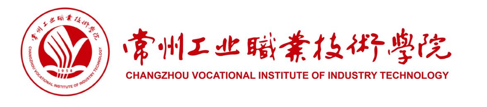
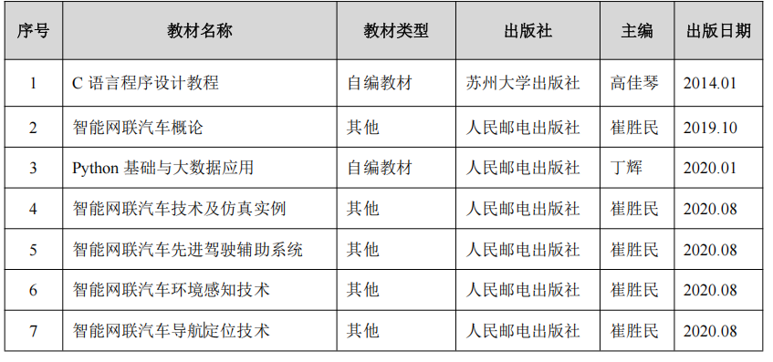
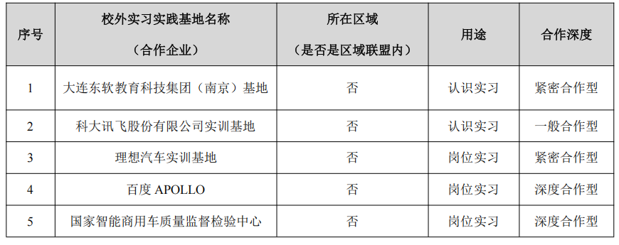
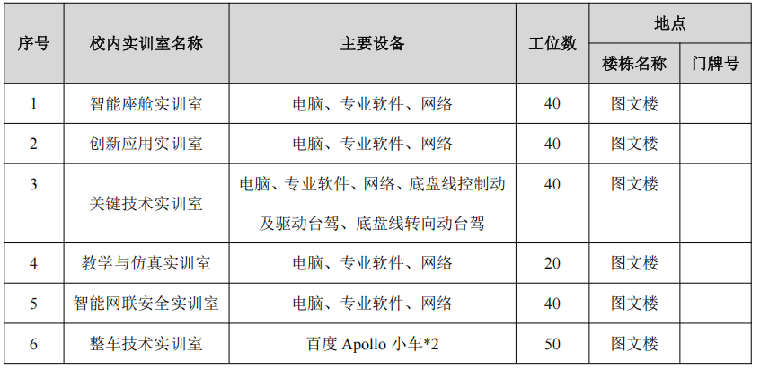
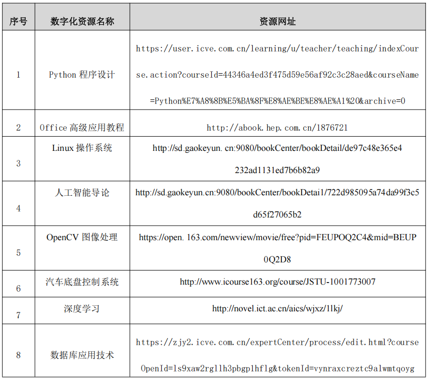

  

|              |                          |
|:------------:|:------------------------:|
| **二级学院** |       信息工程学院       |
|  **执笔人**  |      陆海澎 丰爱松       |
| **合作企业** | 中质智通检测技术有限公司 |
|  **审核人**  |           王新           |
| **制定日期** |        2025年5月         |

常州工业职业技术学院教务处制

2025年4月

---

# 目录

1. 专业名称（专业代码）
2. 入学基本要求
3. 基本修业年限
4. 职业面向
5. 培养目标与培养规格
6. 课程设置及要求
7. 教学进程总体安排
8. 实施保障
9. 毕业要求
10. 附录

---

# 一、 专业名称（专业代码）

智能网联汽车技术（460704）

---

# 二、 入学基本要求

普通高级中学毕业、中等职业学校毕业或具备同等学力

---

# 三、 基本修业年限

三年

---

# 四、 职业面向

**表1 主要岗位群（或技术领域）**

| **所属专业大类（代码）** | 装备制造大类（46） |
|:---:|---|
| **所属专业类（代码）** | 汽车制造类（4607） |
| **对应行业（代码）** | 汽车制造业（36）、智能车载设备制造（3962）、汽车修理与维护（8111） |
| **主要职业类别（代码）** | 汽车工程技术人员 L（2-02-07-11）、汽车运用工程技术人员（2-02-15-01）、汽车整车制造人员（6-22-02）、汽车维修工（4-12-01-01）、智能网联汽车测试员 S（4-04—5-15）、智能网联汽车装调运维员 S（6-31-07-05） |
| **主要岗位（群）或技术领域** | 研发辅助：智能网联汽车整车及系统（部件）样品试制、试验，生产制造：智能网联汽车整车及系统（部件）成品装配、调试、标定、测试、质量检验及相关工艺管理和现场管理，营运服务：智能网联汽车售前售后技术支持…… |
| **职业类证书** | 智能网联汽车测试装调、智能网联汽车共享出行服务…… |

---

# 五、 培养目标与培养规格

## （一）培养目标

本专业培养能够践行社会主义核心价值观，传承技能文明，德智体美劳全面发展，具有一定的科学文化水平，良好的人文素养、科学素养、数字素养、职业道德、创新意识，爱岗敬业的职业精神和精益求精的工匠精神，较强的就业创业能力和可持续发展的能力，掌握本专业知识和技术技能，具备职业综合素质和行动能力，面向汽车制造业的智能车载设备制造、汽车修理与维护等行业的汽车工程技术人员、汽车运用工程技术人员、汽车整车制造人员、汽车维修工等职业，能够从事智能网联汽车整车及系统（部件）的样品试制、试验，成品装配、调试、标定、测试、质量检验及相关工艺管理和现场管理，售前售后技术支持工作的高技能人才。

## （二）培养规格

本专业学生应在系统学习本专业知识并完成有关实习实训基础上，全面提升知识、能力、素质，掌握并实际运用岗位（群）需要的专业核心技术技能，实现德智体美劳全面发展，总体上须达到以下要求：

1.  坚定拥护中国共产党领导和中国特色社会主义制度，以习近平新时代中国特色社会主义思想为指导，践行社会主义核心价值观，具有坚定的理想信念、深厚的爱国情感和中华民族自豪感；
2.  掌握与本专业对应职业活动相关的国家法律、行业规定，掌握绿色生产、环境保护、安全防护、质量管理等相关知识与技能，了解相关行业文化，具有爱岗敬业的职业精神，遵守职业道德准则和行为规范，具备社会责任感和担当精神；
3.  掌握支撑本专业学习和可持续发展必备的语文、数学、外语（英语等）、信息技术等文化基础知识，具有良好的人文素养与科学素养，具备职业生涯规划能力；
4.  具有良好的语言表达能力、文字表达能力、沟通合作能力，具有较强的集体意识和团队合作意识，学习1门外语并结合本专业加以运用；
5.  掌握汽车机械基础、机械制图、汽车电工电子技术、单片机技术应用、C语言程序设计、汽车网络通信基础、智能网联汽车概论、汽车构造等方面的专业基础理论知识；
6.  掌握智能网联汽车整车生产制造技术技能，具有智能传感器、计算平台、线控底盘、智能座舱等系统（部件）的整车装配、调试能力；
7.  掌握智能网联汽车整车参数调优与质量检测技术技能，具有整车标定与测试能力；
8.  掌握智能网联汽车整车故障诊断技术技能，具有维修故障车辆的能力；
9.  掌握智能网联汽车整车和系统（部件）试验、测试技术技能，具有搭建整车测试场景、记录和分析测试数据的能力；
10. 掌握汽车生产现场管理技术技能，具有生产现场班组、设备、质量、安全生产等组织管理能力；
11. 掌握智能网联汽车技术服务技术技能，具有解决智能网联汽车产品售前售后问题的能力；
12. 掌握信息技术基础知识和AI工具使用技巧，具有适应本行业数字化和智能化发展需求的数字技能；
13. 具有探究学习、终身学习和可持续发展的能力，具有整合知识和综合运用知识分析问题和解决问题的能力；
14. 掌握身体运动的基本知识和至少1项体育运动技能，达到国家大学生体质健康测试合格标准，养成良好的运动习惯、卫生习惯和行为习惯；具备一定的心理调适能力；
15. 掌握必备的美育知识，具有一定的文化修养、审美能力，形成至少1项艺术特长或爱好；
16. 树立正确的劳动观，尊重劳动，热爱劳动，具备与本专业职业发展相适应的劳动素养，弘扬劳模精神、劳动精神、工匠精神，弘扬劳动光荣、技能宝贵、创造伟大的时代风尚。

---

# 六、 课程设置及要求

本专业课程主要包括公共基础课和专业（技能）课程。其中，专业（技能）课程包括专业基础课、专业核心课、专业实践课和专业拓展课。

**表2 全部课程**

| 序号 | 课程类别 | 描述 |
|:---:|:---:|---|
| 1 | 公共基础课 | 根据党和国家有关文件规定，将入学教育与急救技能、思想道德与法治、毛泽东思想和中国特色社会主义理论体系概论、习近平新时代中国特色社会主义思想概论、“四史”教育、形势与政策、高等数学、大学英语、体育、军事理论、军训、大学生国家安全教育、大学生职业生涯规划、就业指导、大学生心理健康教育、劳动通识教育、创业之旅、人工智能通识、信息技术等列入公共基础必修课；并将中华优秀传统文化、高等数学2、高等数学（升学）、大学英语（升学）、物理、化学等列入公共限选课。 |
| 2 | 专业基础课 | 智能网联汽车概论、汽车电工电子技术、C 语言程序设计、单片机技术应用、汽车网络通信基础 |
| 3 | 专业核心课 | 智能传感器装调与测试、计算平台部署与测试、底盘线控系统装调与测试、智能座舱系统装调与测试、车路协同系统装调与测试、智能网联整车综合测试 |
| 4 | 专业实践课 (实践性教学环节) | C语言程序设计实训、智能汽车单片机实训、嵌入式系统应用实训、车路协同（V2X）实训、智能网联汽车线控驱动及制动实训、智能网联汽车线控转向实训、传感器装配及标定实训、人工智能实训、智能网联整车综合测试、专业综合实践、顶岗实习1、顶岗实习2、毕业设计 |
| 5 | 专业拓展课 | 专业拓展课总课时不低于128，包括：数学建模与数据分析、Python程序设计、智能网联汽车导航定位技术 |

---

## （一）公共基础课

**表3 公共基础课程目标**

| 课程模块 | 课程名称 | 课程性质 | 课程目标 |
|:---:|:---:|:---:|---|
| 思政教育课程模块 | 思想道德与法治 | 必修 | 引导学生提高思想道德素质和法治素养，成长为自觉担当民族复兴大任的时代新人。 |
| 思政教育课程模块 | 毛泽东思想和中国特色社会主义理论体系概论 | 必修 | 引导学生系统把握马克思主义中国化时代化理论成果所蕴含的马克思主义立场、观点和方法，坚定中国特色社会主义道路自信、理论自信、制度自信、文化自信，增进政治认同、思想认同、情感认同，使其努力成为堪当民族复兴重任的时代新人。 |
| 思政教育课程模块 | 习近平新时代中国特色社会主义思想概论 | 必修 | 帮助学生深入领会和理解习近平新时代中国特色社会主义思想的重大意义、丰富内涵、核心要义、精神实质和实践要求。引导学生深刻把握习近平新时代中国特色社会主义思想贯穿的马克思主义立场观点方法。引领学生紧密联系新时代中国特色社会主义生动实践，在知行合一、学以致用上下功夫，增强学生为实现中华民族伟大复兴的中国梦而奋斗的责任意识与使命担当。 |
| 思政教育课程模块 | 形势与政策 | 必修 | 提高大学生运用马克思主义理论分析国内、国际形势与政策的能力和大学生思想政治素养。 |
| 思政教育课程模块 | “四史”教育 | 必修 | 通过开发“四史”专题内容设计，采用线上线下结合的方式，开发“四史”特色课程，学生在学“四史”中深化思想基础、升华感悟境界、厚植家国情怀。（分为四个模块：中国共产党历史、新中国史、改革开放史、社会主义发展史） |
| 创新创业课程模块 | 创意创新训练 | 必修 | 通过基于设计思维的创新思维及工具方法训练，培养学生的问题意识、批判意识和创造性思维，提升学生发现新事物、探索新领域、寻求新方法等方面的能力，以及创新性解决实际问题的综合能力。 |
| 创新创业课程模块 | 创业之旅 | 必修 | 立足培养学生的创业意识和创业精神，着重提升学生的创新创业能力，强化创业知识的实际应用，强调与专业结合，与职业生活紧密结合。 |
| 文化传承与人文素养 | 大学语文 | 必修 | 培养学生听说读写母语应用能力、文学鉴赏能力与沟通表达、应用写作能力等通用职业能力，提升人文素养。 |
| 文化传承与人文素养 | 大学英语1 | 必修 | 通过课程学习，培养学生在工作和社会交往中用英语有效地进行口头和书面信息交流；同时增强其自主学习能力、跨文化交际能力及综合文化素养，培养其逻辑思维能力、主动学习的意识和合作精神。 |
| 文化传承与人文素养 | 大学英语2 | 必修 | 通过课程学习，培养学生在真实或模拟的情境中求职和进行职业活动的语言综合应用能力、跨文化交流能力、语言学习策略和职业素养，以满足中外职场环境下对英语应用型人才的需求。 |
| 文化传承与人文素养 | 高等数学1 | 必修 | 通过课程学习，让学生掌握数学基础知识，促进学生数学应用、自主学习、交流表达、自我提高、与人合作、解决问题等能力。 |
| 文化传承与人文素养 | 高等数学2 | ◆公共限选课 | 通过课程学习，提高学生的数学素养和解决实际问题的能力，达到学业、职业、素养等方面的提升。 |
| 文化传承与人文素养 | 中华优秀传统文化 | ◆公共限选课 | 以中华优秀传统文化教学为基础和依托，探究中华优秀传统文化的本质、特性及其与现代化的关系，引导学生联系现实，深入思考，把传统文化知识的学习落实到发掘传统文化现实意义上去。课程旨在完善学生的知识结构，加强学生的人文素质教育，弘扬中华传统文化，培养民族自豪感和爱国主义精神，促进学生德技并修、全面发展。 |
| 文化传承与人文素养 | 高等数学（升学） | ◆公共限选课 | 通过课程学习帮助学生升学需要达到的专业知识和技能 |
| 文化传承与人文素养 | 大学英语（升学） | ◆公共限选课 | 通过课程学习帮助学生升学需要达到的专业知识和技能 |
| 文化传承与人文素养 | 物理 | ◆公共限选课 | 通过课程学习帮助学生升学需要达到的专业知识和技能 |
| 文化传承与人文素养 | 化学 | ◆公共限选课课 | 通过课程学习帮助学生升学需要达到的专业知识和技能 |
| 信息素养 | 信息技术/信息技术实训 | 必修 | 通过学习能够增强信息意识、提升计算思维、促进数字化创新与发展能力、树立正确的信息社会价值观和责任感，为其职业发展、终身学习和服务社会奠定基础。 |
| 国防教育与身心健康 | 体育 | 必修 | 采用系统的课堂教学与有组织的课外体育活动相结合的方式，传授体育的基本知识、技能和方法，增进学生身心健康、增强体质，提升综合职业能力，形成终身参与体育锻炼的良好习惯，提升学生职业素养。 |
| 国防教育与身心健康 | 大学生心理健康教育 | 必修 | 旨在使学生明确心理健康的标准及意义，增强自我心理保健意识和心理危机预防意识，掌握并应用心理健康知识，培养自我认知能力、人际沟通能力、自我调节能力，切实提高心理素质，促进学生全面发展。 |
| 国防教育与身心健康 | 军训 | 必修 | 通过条令条例教育与训练、轻武器射击、战术、军事地形学、综合训练等项目的训练，增强学生的纪律性与凝聚力，提高身体素质，培养吃苦耐劳精神，增强团队合作意识。 |
| 国防教育与身心健康 | 军事理论 | 必修 | 培养学生的思想政治觉悟，激发爱国热情，增强国防观念和国家安全意识；使学生掌握基本军事知识和技能，为中国人民解放军培养后备兵员和预备役军官、为国家培养社会主义事业的建设者和接班人打好基础。 |
| 国防教育与身心健康 | 入学教育与急救技能 | 必修 | 帮助学生了解校纪校规、学院生活环境、大学学习要求与毕业要求；开展《实验室安全准入教育》课程学习，提高学生实验室安全知识和安全意识。分专题进行急救知识的讲解，使学生掌握必要的自救互救知识和技能。 |
| 国防教育与身心健康 | 大学生国家安全教育 | 必修 | 通过结合讲授时事热点和经典案例等不同类型的内容，帮助学生系统掌握中国特色国家安全体系，树立国家安全底线思维，将国家安全意识转化为自觉行动，强化责任担当。 |
| 职业素养 | 大学生职业生涯规划 | 必修 | 通过学习，树立积极的职业态度和就业观念，掌握职业生涯规划方法，具备自我认识和分析技能。 |
| 职业素养 | 就业指导 | 必修 | 通过系统化的就业指导，使学生了解就业形势和就业政策，提高就业竞争意识，形成正确的就业观。 |
| 职业素养 | 劳动通识教育 | 必修 | 强化劳动精神、工匠精神，指导劳动实践，将德智体美劳全面发展的高素质劳动者作为课程培养目标。 |
| 职业素养 | 人工智能通识课 | 必修 | 本课程聚焦人工智能基础与应用，结合智能语音、图像识别等常见场景，介绍大模型、生成式AI等前沿概念。帮助学生理解AI原理，掌握AI工具使用技巧，提升数字化思维与创新能力，为未来职业发展奠定基础。 |

---

## （二）专业（技能）课程

**表4 专业（技能）课程目标**

| 课程模块 | 课程名称 | 课程性质 | 课程目标 |
|:---:|:---:|:---:|---|
| 专业基础课 | 智能网联汽车概论 | 必修课 | 通过本课程的学习，让学生能够了解智能网联汽车的定义，培养学生独立解决问题的能力和创新能力，拓宽学生的视野。 |
| 专业基础课 | 汽车电工电子技术 | 必修课 | 掌握汽车电路基础、电子元件工作原理及典型电路分析方法，熟悉汽车电源、起动、点火等系统结构与故障诊断流程。能够运用万用表、示波器等工具检测传感器、执行器信号，具备汽车电气系统调试与简单电路设计能力，理解新能源汽车电子技术发展趋势，为汽车维修与智能化改造奠定基础。 |
| 专业基础课 | C 语言程序设计 | 必修课 | 通过本课程学习，让学生掌握程序设计的基本思维方式 |
| 专业基础课 | 单片机技术应用 | 必修课 | 通过学习，要求学生具备单片机小系统的开发与应用、单片机系统程序设计与调试等方面的知识与能力;同时，通过本课程的学习，培养学生成为理论联系实际、勇于创新、团队协作的高素质技能型专门人才。 |
| 专业基础课 | 汽车网络通信基础 | 必修课 | 通过本课程学习，让学生熟悉车载网络技术的应用背景、功能、特点以及网络技术在汽车上的应用情况，发展趋势等内容。 |
| 专业核心课 | 智能传感器装调与测试 | 必修课 | 通过本课程学习，使学生掌握传感器的结构、原理、特点、类型、标定、测试和应用等知识，掌握环境感知传感器的认知、装配、调试、测试、标定和目标识别等相关技能。 |
| 专业核心课 | 计算平台部署与测试 | 必修课 | 培养学生掌握智能网联汽车计算平台的部署与测试技能，理解平台架构与关键技术，提升系统优化与故障排除能力，为智能网联汽车技术的研发与应用奠定坚实基础。 |
| 专业核心课 | 底盘线控系统装调与测试 | 必修课 | 通过本课程的学习，让学生能够了解智能网联汽车线控模块的组成，了解线控技术的相关理论知识。 |
| 专业核心课 | 智能座舱系统装调与测试 | 必修课 | 掌握智能座舱系统的装配、调试与测试技能，培养实际操作能力，提升系统故障诊断与修复能力，为从事汽车智能化技术工作奠定坚实基础。 |
| 专业核心课 | 车路协同系统装调与测试 | 必修课 | 理解车路协同（V2X）系统架构、通信协议及数据交互机制，掌握车载终端（OBU）与路侧单元（RSU）的安装调试流程。能够使用专业工具进行信号覆盖测试、通信延迟分析及功能验证，具备故障排查与系统优化能力，熟悉车路协同场景测试标准，为智能交通系统部署提供技术支持。 |
| 专业核心课 | 智能网联整车综合测试 | 必修课 | 掌握智能网联汽车整车级测试流程与方法，包括自动驾驶功能、车联网通信及人机交互系统测试。能够搭建测试场景、设计测试用例，运用数据采集与分析工具评估系统性能，定位并解决多系统协同问题，熟悉相关法规与安全标准，确保整车功能符合商业化落地要求。 |
| 专业实践课 (实践性教学环节) | C语言程序设计实训 | 必修课 | 通过本实训，学生应掌握使用编译软件编写及调试程序的方法，并掌握程序调试的主要方法和技能。 |
| 专业实践课 (实践性教学环节) | 智能汽车单片机实训 | 必修课 | 通过本实训使学生深入了解嵌入式系统开发的步骤与方法，初步掌握嵌入式系统的软硬件协同开发要点及使用方法。巩固和强化理论教学内容，综合课程教学中的实验环节，培养和锻炼学生的工程实践能力，初步具备嵌入式系统软硬件协同开发应用程序的能力。 |
| 专业实践课 (实践性教学环节) | 嵌入式系统应用实训 | 必修课 | 通过本实训使学生掌握计算机组成原理，学会嵌入式开发平台搭建、初步具有嵌入式 Linux 应用编程的能力。 |
| 专业实践课 (实践性教学环节) | 车路协同（V2X）实训 | 必修课 | 通过本实训，让学生了解先进的无线通信和互联网等技术，掌握全方位实施人、车、路动态信息实时交互的理论知识。 |
| 专业实践课 (实践性教学环节) | 智能网联汽车线控驱动及制动实训 | 必修课 | 通过本实训，让学生能够了解智能网联汽车线控模块的组成，了解线控技术的相关理论知识并用于实践。 |
| 专业实践课 (实践性教学环节) | 智能网联汽车线控转向实训 | 必修课 | 通过本实训，让学生能够掌握线控转向系统的理论知识，掌握主动控制系统相关知识。了解主动控制可以实现车道保持功能、自动泊车甚至自动驾驶等辅助驾驶功能。 |
| 专业实践课 (实践性教学环节) | 传感器装配及标定实训 | 必修课 | 通过本实训，使学生掌握传感器的装配、标定、测试和应用等知识，掌握环境感知传感器的认知、装配、调试、测试、标定和目标识别等相关技能。 |
| 专业实践课 (实践性教学环节) | 人工智能实训 | 必修课 | 通过本实训，让学生能够了解人工智能的定义，实现语音识别语音合成图像识别等功能，培养学生独立解决问题的能力和创新能力，拓宽学生的视野。 |
| 专业实践课 (实践性教学环节) | 智能网联整车综合测试 | 必修课 | 通过本实训，使学生能够以当前量产级 L3 级别自动驾驶车辆为主导，掌握 L3 级别乘用车所采用自动驾驶架构、自动驾驶计算平台硬件架构以及自动驾驶 AI 计算单元装配调试 |
| 专业实践课 (实践性教学环节) | 专业综合实践 | 必修课 | 通过本实训，让学生能够对智能网联汽车有全方位的认识，培养学生全局意识，拓宽学生的视野。 |
| 专业实践课 (实践性教学环节) | 顶岗实习 | 必修课 | 通过本实训，让学生能够对智能网联汽车技术专业相关工作岗位有全方位的认识，培养学生敬业精神。 |
| 专业实践课 (实践性教学环节) | 毕业设计 | 必修课 | 综合运用所学知识，针对智能网联汽车领域选定课题（如自动驾驶算法优化、车路协同场景应用等），完成需求分析、方案设计、系统开发与测试验证。培养独立研究能力、工程实践能力及学术论文撰写能力，通过项目实践解决行业实际问题，展现创新应用与技术整合水平，为职业发展奠定基础。 |
| 专业拓展课 （专业选修课） | 数学建模与数据分析 | 必修课 | 培养学生利用数学工具进行智能网联汽车系统建模和数据分析的能力，深入理解汽车控制算法，提升数据处理与算法优化技能，为智能车辆开发提供有效工具。 |
| 专业拓展课 （专业选修课） | Python程序设计 | 必修课 | 通过本课程学习，让学生掌握程序设计的基本思维方式及人工智能编程环境。 |
| 专业拓展课 （专业选修课） | 智能网联汽车导航定位技术 | 必修课 | 通过本课程的学习，使学生熟悉智能网联汽车导航定位的定义、方法、精度要求及高精度定位关键技术；了解智能网联汽车定位仿真技术。 |

> 各门课程的课程目标、主要内容和教学要求，见附录2：《课程标准汇编》。

---

# 七、 教学进程总体安排

## （一）教学环节安排表

**表6 教学环节表安排**

| 学年 | 学期 | 军训/入学教育 | 实践专用周 | 理论教学周 | 考试周 | 机动\放假 | 合计 |
|:---:|:---:|:---:|:---:|:---:|:---:|:---:|:---:|
| 一 | 1 | 2+1 | 2 | 12 | 1 | 1 | 19 |
| 一 | 2 | 　 | 6 | 12 | 1 | 1 | 20 |
| 二 | 3 | | 6 | 12 | 1 | 1 | 20 |
| 二 | 4 | 　 | 6 | 12 | 1 | 1 | 20 |
| 三 | 5 | | 5 | | | | 20 |
| 三 | 5 | | 15 | | | | 20 |
| 三 | 6 | 　 | 5 | | | | 15 |
| 三 | 6 | 　 | 10 | | | | 15 |
| 总计 | - | 3 | 55 | 48 | 4 | 4 | 114 |

## （二）教学进程表

见附录1.教学进程表。

## （三）各类课程学时（学分）比例表

**表7 各类课程学时（学分）比例表**

| | 课程模块 | 总学时 | 实践学时 | 实践学时占总学时的比例 | 学分 |
|:---:|---|:---:|:---:|:---:|:---:|
| 必修课 | ①公共基础课 | 784 | 220 | 28.1% | 43.5 |
| 必修课 | ②专业基础课 | 228 | 102 | 44.44% | 14.5 |
| 必修课 | ③专业核心课 | 228 | 114 | 50% | 15.5 |
| 必修课 | ④专业实践课 (实践性教学环节) | 1092 | 1092 | / | 53 |
| 选修课 | ⑤公共选修课 | 128 | / | / | 8 |
| 选修课 | ⑥专业选修课 （专业拓展课） | 132 | 66 | 50% | 8.5 |
| | **总计** | **2592** | **1594** | **61%** | **143** |

> 注：④实践性教学环节包括实验实训、实习、毕业设计、社会实践；公共基础课学时（①+⑤）不低于总学时的25%；实践性教学学时原则上不低于总学时的50%；各类选修课（⑤+⑥）累计学时不低于总学时的10%。

**表8 不同课程类型学时比例表**

| 课程类型 | 学时 | 学时比例（%） |
|:---:|:---:|:---:|
| A类（纯理论课） | 504 | 19.44 |
| B类（理论＋实践）课 | 912 | 35.19 |
| C类（纯实践课） | 1176 | 45.37 |
| **总计** | **2592** | **100** |

---

# 八、 实施保障

## （一）师资队伍

按照“四有好老师”“四个相统一”“四个引路人”的要求建设专业教师队伍，将师德师风作为教师队伍建设的第一标准。

### 1.队伍结构

学生数与本专业专任教师数比例不高于25∶1，“双师型”教师占专业课教师数比例达60%，高级职称专任教师的比例30%，整合校内外优质人才资源，选聘企业高级技术人员担任行业导师，兼职教师3人，组建校企合作、专兼结合的教师团队，建立定期开展专业联合教研活动机制。

### 2.专业带头人

陆海澎，生1990年05月，讲师，信息工程学院副院长，毕业于上海海事大学，工程硕士，江苏省教学能力大赛 2020 年、2022 年二等奖获得者。近年来，主持了多项教科研课题，能够较好地把握国内外智能网联汽车行业、专业发展，能广泛联系行业企业，了解行业企业对本专业人才的需求实际，教学设计、专业研究能力强，组织开展教科研工作能力强，在本区域或本领域具有一定的专业影响力。

### 3.专任教师

具有高校教师资格，原则上具有有车辆工程、汽车服务工程、智能车辆工程、新能源汽车工程、新能源汽车工程技术、智能网联汽车工程技术、汽车维修工程教育、计算机科学与技术、电子与通信工程、软件工程等相关专业本科及以上学历；具有一定年限的相应工作经历或者实践经验，达到相应的技术技能水平；具有本专业理论和实践能力；能够落实课程思政要求，挖掘专业课程中的思政教育元素和资源；能够运用信息技术开展混合式教学等教法改革；能够跟踪新经济、新技术发展前沿，开展技术研发与社会服务；专业教师每年至少1个月在企业或生产性实训基地锻炼，每5年累计不少于6个月的企业实践经历。

**表9 专业专任教师一览表**

| 序号 | 姓名 | 年龄 | 职称 | 学历 | 最高学位专业 | 是否双师 | 备注 |
|:---:|:---:|:---:|:---:|:---:|:---:|:---:|---|
| 1 | 陆海澎 | 35 | 讲师 | 研究生 | 硕士 | 是 | 专业带头人 |
| 2 | 徐亦卿 | 32 | 讲师 | 研究生 | 硕士 | 是 | 教研室主任 |
| 3 | 王新 | 49 | 副教授 | 研究生 | 学士 | 是 | 骨干教师 |
| 4 | 周国华 | 43 | 副教授 | 研究生 | 硕士 | 是 | 骨干教师 |
| 5 | 陆小丹 | 33 | 讲师 | 研究生 | 硕士 | 是 | 教师 |
| 6 | 李世杰 | 28 | 助教 | 研究生 | 硕士 | 否 | 教师 |
| 7 | 薛新宇 | 30 | 助教 | 研究生 | 硕士 | 否 | 教师 |

### 4.兼职教师

本专业相关行业企业的高技能人才，应具有扎实的专业知识和丰富的实际工作经验，一般应具有中级及以上专业技术职务（职称）或职业技能等级，了解教育教学规律，能承担专业课程教学、实习实训指导和学生职业发展规划指导等专业教学任务。

**表10 专业兼职教师一览表**

| 序号 | 姓名 | 职称 | 工作单位 | 岗位或职务 | 承担的兼职工作 |
|:---:|:---:|:---:|---|---|---|
| 1 | 钱吉明 | 高级工程师 | 百度阿波罗智联（北京）科技有限公司 | 总监 | 专业建设 |
| 2 | 潘宇 | 高级工程师 | 百度阿波罗智联（北京）科技有限公司 | 总监 | 课程开发 |
| 3 | 黄河 | 高级工程师 | 百度阿波罗智联（北京）科技有限公司 | 高级经理 | 课程建设 |
| 4 | 丰爱松 | 高级工程师 | 国家智能商用车质量监督检验中心 | 主任 | 课程教学 |

---

## （二）教学设施

### 1.专业教室条件

具备利用信息化手段开展混合式教学，配备黑（白）板、多媒体计算机、投影设备、音响设备，具有互联网接入或无线网络环境及网络安全防护措施。安装应急照明装置并保持良好状态，符合紧急疏散要求，安防标志明显，保持逃生通道畅通无阻。

### 2.校内实验实训室条件

实验、实训场所面积、设备设施、安全、环境、管理等符合教育部有关标准（规定、办法），实验、实训环境与设备设施对接真实职业场景或工作情境，实训项目注重工学结合、理实一体化，实验、实训指导教师配备合理，实验、实训管理及实施规章制度齐全。鼓励在实训中运用大数据、云计算、人工智能、虚拟仿真等前沿信息技术。

**表11 校内实训室**

  

### 3.学生实习基地条件

符合《职业学校学生实习管理规定》《职业学校校企合作促进办法》等对实习单位的有关要求，经实地考察后，确定合法经营、管理规范，实习条件完备且符合产业发展实际、符合安全生产法律法规要求，与学校建立稳定合作关系的单位成为实习基地，并签署学校、学生、实习单位三方协议。

根据本专业人才培养的需要和未来就业需求，实习基地应能提供与本专业对口的相关实习岗位，能涵盖当前相关产业发展的主流技术，可接纳一定规模的学生实习；学校和实习单位双方共同制订实习计划，能够配备相应数量的指导教师对学生实习进行指导和管理，实习单位安排有经验的技术或管理人员担任实习指导教师，开展专业教学和职业技能训练，完成实习质量评价，做好学生实习服务和管理工作，有保证实习学生日常工作、学习、生活的规章制度，有安全、保险保障，依法依规保障学生的基本权益。

  

> **表12 校外实习基地**

---

## （三）教学资源

### 1.教材选用情况

**表13 专业教材选用表**

  

### 2.图书、文献配备情况

图书文献配备须满足人才培养、专业建设、教科研等工作的需要。及时配置新经济、新技术、新工艺、新材料、新管理方式、新服务方式等相关的图书文献。

### 3.数字教学资源配置情况

建设、配备与本专业有关的音视频素材、教学课件、数字化教学案例库、虚拟仿真软件等专业教学资源库，种类丰富、形式多样、使用便捷、动态更新、满足教学。

**表14 专业数字化资源选用表**

  

---

## （四）质量管理

1.  建立专业人才培养质量保障机制，健全专业教学质量监控管理制度，改进结果评价，强化过程评价，探索增值评价，吸纳行业组织、企业等参与评价，并及时公开相关信息，接受教育督导和社会监督，健全综合评价。完善人才培养方案、课程标准、课堂评价、实验教学、实习实训、毕业设计以及资源建设等质量保障建设，通过教学实施、过程监控、质量评价和持续改进，达到人才培养规格要求。

2.  完善教学管理机制，加强日常教学组织运行与管理，定期开展课程建设、日常教学、人才培养质量的诊断与改进，建立健全巡课、听课、评教、评学等制度，建立与企业联动的实践教学环节督导制度，严明教学纪律，强化教学组织功能，定期开展公开课、示范课等教研活动。

3.  专业教研室建立线上线下相结合的集中备课制度，定期召开教学研讨会议，利用评价分析结果有效改进专业教学，持续提高人才培养质量。

4.  建立毕业生跟踪反馈机制及社会评价机制，并对生源情况、职业道德、技术技能水平、就业质量等进行分析，定期评价人才培养质量和培养目标达成情况。

---

# 九、 毕业要求

根据专业人才培养方案确定的目标和培养规格，完成规定的实习实训，全部课程考核合格或修满学分，准予毕业。

| 序号 | 课程类型 | | 应修学分 |
|:---:|---|---|:---:|
| 1 | 培养方案必修课程 | | 131 |
| 2 | 培养方案选修课程 | 公共选修课程 | 8 |
| 3 | 培养方案选修课程 | 专业选修课程 | 8 |
| 4 | 素质拓展（第二课堂） | | 18 |

---

# 十、 附录

## 附录1：

### （一）教学进程表

### （二）公共选修课课程列表

| 课程类型 | 课程学时 | 课程学分 | 备注 |
|---|:---:|:---:|---|
| 文学修养与协作沟通 | 32 | 2 | 四类中各任选一门课程修读8学分 |
| 艺术鉴赏与审美能力 | 32 | 2 | 四类中各任选一门课程修读8学分 |
| 自然科学与数字素养 | 32 | 2 | 四类中各任选一门课程修读8学分 |
| 自我管理与社会公民 | 32 | 2 | 四类中各任选一门课程修读8学分 |

## 附录2.课程标准汇编
